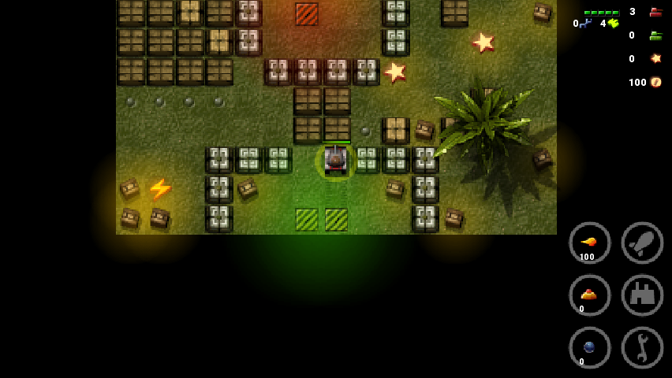

# Tankzors Pro
`Tankzors Pro` is a j2me arcade game made by `DaSuppaStudio`, ported for PC and Android  

# Technical Info

- LibGDX 1.9.10
- Gradle 5.6.2
- Java 1.7

# Controls

- `AWSD` - move left, up, down, right
- `Q` - enter the hangar (green striped square)
- `E` - show weapons inventory
- `R` - quick tank repair
- `NUMPAD1` - used for shooting various bullets
- `NUMPAD2` - used for laying mines and TNT
- `NUMPAD3` - used for shooting artillery and calling airstrike